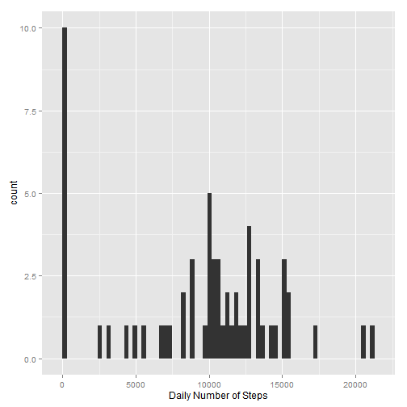
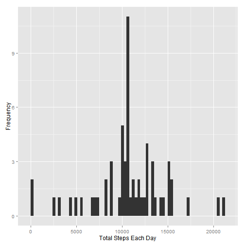

## Loading and preprocessing the data


```r
activity <- read.csv("activity.csv")
```

```
## Warning in file(file, "rt"): cannot open file 'activity.csv': No such file
## or directory
```

```
## Error in file(file, "rt"): cannot open the connection
```

```r
activity$date <- as.Date(activity$date)
```

## What is mean total number of steps taken per day?

### Histogram of daily steps


```r
library(ggplot2)
dailysteps <- aggregate(activity$steps, by = list(activity$date), FUN = sum ,na.rm=TRUE)
names(dailysteps) <- c("Date", "steps")
qplot(steps, data = dailysteps, geom="histogram", xlab = "Daily Number of Steps", binwidth = 300)
```

 

### Mean of daily steps


```r
meansteps <- mean(dailysteps$steps)
```
The mean daily steps is 

```r
meansteps
```

```
## [1] 9354.23
```

### Median of daily steps


```r
mediansteps <- median(dailysteps$steps)
```
The median daily steps is 

```r
mediansteps
```

```
## [1] 10395
```

## What is the average daily activity pattern?


```r
int_steps <- aggregate(activity$steps, by = list(activity$interval), mean, na.rm=TRUE)
names(int_steps) = c("interval","mean.steps")
plot(int_steps$interval, int_steps$mean.steps, type = "l",main = 'Average Steps by Time Interval',xlab = '5 Minute Time Interval', ylab = 'Average Number of Steps')
```

 

The 5-minute interval, on average across all the days in the dataset, which contains the maximum number of steps is

```r
most.steps <- int_steps$interval[int_steps$mean.steps == max(int_steps$mean.steps)]
most.steps
```

```
## [1] 835
```

## Imputing missing values

The number of NA's in the original data set is


```r
sum(is.na(activity$steps))
```

```
## [1] 2304
```

Fill in all NA's with the mean calculated previously for each 5 minute time interval across all days.


```r
cleanData <- activity
cleanData$steps[is.na(cleanData$steps)] <- 
    tapply(cleanData$steps, cleanData$interval, mean, na.rm = TRUE)
```


Histogram of cleaned data:


```r
cleanNumSteps <- tapply(cleanData$steps, cleanData$date, sum)
qplot(
    cleanNumSteps, 
    xlab='Total Steps Each Day', 
    ylab='Frequency', binwidth = 300)
```

 

The mean number of daily steps is now:

```r
meansteps <- mean(cleanNumSteps)
meansteps
```

```
## [1] 10766.19
```

The median number of daily steps is now:

```r
mediansteps <- median(cleanNumSteps)
mediansteps
```

```
## [1] 10766.19
```

## Are there differences in activity patterns between weekdays and weekends?

Add Day to the cleanData


```r
cleanData$Day <- weekdays(as.Date(as.character(cleanData$date)))
```

Add weekend value to the cleanData

```r
cleanData$DayType <- as.factor(c("Weekend","Weekday"))

weekendDays <- cleanData$Day == "Saturday" | cleanData$Day == "Sunday"

cleanData$DayType[weekendDays] = "Weekend"
cleanData$DayType[!weekendDays] = "Weekday"
```

Find the 5-minute interval, on average across all the days in the cleaned dataset, 


```r
int_steps2 <- aggregate(cleanData$steps, by = list(cleanData$DayType, cleanData$interval), mean)
names(int_steps2) = c("weekday", "interval","mean.steps")
```

and plot by weekend or weekday.


```r
ggplot(int_steps2, aes(x = interval, y = mean.steps)) + ylab("Number of Steps") + geom_line() + facet_grid(weekday~.)
```

 


